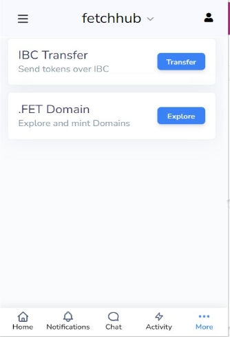
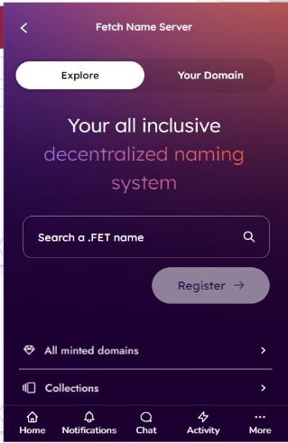

## . FET Domain

The fetch wallet us new feature is the.FET domain, which allows you to add a domain with the.FET. When a domain is purchased, it is automatically registered on the blockchain. This process is known as automatic mining. We'll generate a new wallet address for you when you register an Unstoppable account, mint all domains directly to this address, and allow you to move these out to a personal wallet whenever you choose.

All domains will be minted at the time of purchase thanks to changes we're making to the way we mint Web3 names.

Now, when you sign up for an Unstoppable account, we'll generate a new wallet address for you, mint all of your domains directly to this address, and allow you to move them out to a personal wallet whenever you want.

After you have registered your domain, this information will transfer permanently from our database to the blockchain and then to your cryptocurrency wallet.

To register a. FET domain:

0. Search a. FET name in the search bar and then register it.
0. Select MINT and click on the continue button.
0. Approve the mint.
0. You can see this domain in your domain list and you can update it        anytime.

