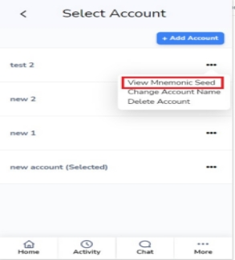
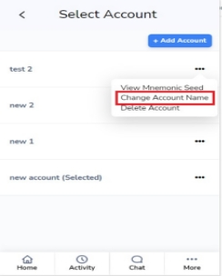

**Hemberger Menu’s**
**

1. ` `**Settings** 

To view or change settings in your fetch Wallet Account, you should follow the below steps.

1. Click the Hamburger symbol in the top left corner of the wallet dashboard then select settings.
1. Now you can change the settings as per your requirements.

1. ## Guide -

To view the official guide for the Fetch wallet, simply click on the Guide button from the Hamburger menu. This will take you to a new tab where you can accept or decline the cookie settings and view the guide. where the user can see a detailed breakdown of all the features of the wallet.

1. ## Add Token

In addition to all the existing tokens, you can add new tokens by simply entering your        address. Token details will then be shown below, you just need to click the

submit button.

1. ## Token List

Your entire list of added tokens will be visible in the token list, where you can edit or remove any tokens you do not want. You can store all your tokens more conveniently.

1. ## Account management

- For first time user: The welcome page will be displayed when you first open     the wallet.

- Already have an account:
  1. Make sure the wallet has access to you.
  1. In the dashboard's upper right corner, click the account icon, followed by                      + Add Account.

1. ## changing account

1. To switch between the several accounts, you have set up on the Fetch wallet.
1. Make sure the wallet has access to you.
1. In the dashboard's upper right corner, click the account icon.
1. Choose the account that you want to change to.

1. ## View mnemonic seeds

A set of 12 to 24 words produced by fetch wallet is referred to as a recovery phrase or seed phrase. If your wallet is lost, damaged, stolen, or otherwise unavailable, you can use this phrase to locate it.

In essence, a recovery phrase is your wallet's private key in human-readable form, which you may use to sign transactions and assert ownership of wallet addresses. Your recovery phrase must be kept in a safe, secret place, just like your bank account login information or email credentials.

1. In the dashboard's upper right corner, click the account icon.
1. Choose View Mnemonic Seed by pressing the ... (three dot) symbol next                                                 to the account.
1. Enter the password for your wallet.
1. To view the mnemonic seed of the account, click Confirm.

1. ## Change account name

You may want to create numerous separate accounts for security reasons. When you create a new account in the Fetch wallet, you must also give it a name.

Luckily, these names are not permanent, and you may always rename your accounts to distinguish between them.

1. In the dashboard's upper right corner, click the account icon.
1. Choose change account name by pressing the ... (three dot) symbol next to the    account you want to change name
1. Enter a new account name.
1. Click on Save.

1. ## Delete Account

To remove a specific account from your Fetch wallet

1. In the dashboard's upper right corner, click the account icon.
1. Choose Delete Account by pressing the ... (three dot) symbol next to the account you want to delete.
1. Enter the password for your wallet.
1. To remove the account from your wallet, click Confirm.

