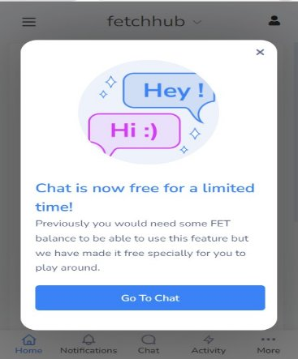
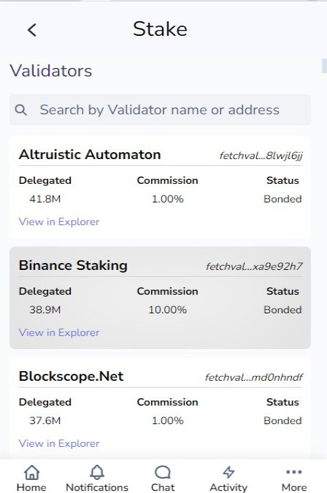

# **How to use Fetch Wallet**
1. # **Home Section**

When you first open the wallet from the extension, it displays the chat popup. You can close it by clicking the cross icon or navigate to the chat screen.

1. ## Total Balance

The Fetch Wallet allows for simple communication with the Fetch blockchain while also supporting Osmosis and Juno Network, two other Cosmos-based networks. Tokens can be transferred to other accounts directly through the wallet or through the IBC (Inter-Blockchain Communication) protocol.

Here you can check the balance of your fetch wallet, also you can see available, staked and rewards FET of the wallet.

1. ## Deposit FET

To add money to your Fetch wallet account.

1. Click on the “Deposit FET button.”
1. You can deposit the desired FET by scanning the QR code.
1. The balance ought to be updated after the tokens have been sent.

1. ## Buy Tokens

Fetch.ai token (FET) can be purchased on a cryptocurrency exchange. These specialized markets, which function like stock trading platforms, let you purchase and sell bitcoins. Fetch.ai is a cutting-edge platform that combines blockchain, machine learning, and artificial intelligence to create a digital economy that is as automated as possible, obviating the need for human participation and manual errors.

Click on the **"Buy Tokens"** buttons to be redirected to the official "Fetch.ai" website, where you can purchase the tokens.

1. ## Send Tokens

To send tokens from your account.

1. Choose Send.
1. Complete the transactional information below:
1. Recipient: -The address you want to transfer the tokens to is the recipient.
1. Token: - the value or kind of the token.
1. Amount: -The quantity of tokens you want to transmit as part of this transaction.
1. Memo (Optional): Some transactions (such as those to/from certain

   exchanges) call for a particular memo. If not required, leave it empty.

1. Fee: -The transaction fee is the fee. Select between Low, Average, and High.
1. Advanced: In advance, the gas fee is automatically added to the gas

   amount field, or you can adjust the gas fee using the "Gas Adjustment" text field.

1. Click send.

`          `1.4.1.10     Review the information on the summary screen, and if everything is                                                        accurate,    click approve.

![ref1]

1. ## Staking

Staking is the process of locking up some of your tokens to take part in the functioning of a blockchain network, boost its security, and receive some passive dividends. Proof-of-stake (POS) is the consensus protocol used by the open, decentralized blockchain network Fetch. For the operators of POS-based networks, sometimes referred to as validators, to be eligible for rewards from their    labor, they must lock up some tokens.

A validator must fulfil number of requirements, such as staking a minimum number of tokens. Users with fewer tokens could still participate by allocating stake to a certain validator to obtain a portion of the profits.

To stack or unstack, simply follow these steps-

1. Make sure you are logged into your Fetch wallet before you stake.
1. Select Stake from the dashboard of your wallet. You should be taken to the ledger browser after that. A list of all current validators with whom you can

   stake your FETs can be found here. Additionally, you can view the FET staked to each validator as well as their commission rates.

1. Choose a validator to stake your FETs with, or use the search bar, and then click Stake or Unstake.
1. Enter the FETs you want to assign or remove stake from this validator, then click Stake/Unstake.
1. You may get a summary of the transaction in your Fetch Wallet. Review it,

   choose a transaction fee, and then click Approve to carry out the transaction if    you are satisfied.

![ref2]

# 1\.6 Claim

If your account has any staked tokens, you can withdraw your rewards from the wallet:

1. Select Claim from the wallet dashboard.
1. You can get a summary of the transaction in the wallet. Review it, choose a transaction fee, and then click Approve to carry out the transaction if you are satisfied.
1. The rewards should now be shown as an addition to your Total Balance.

![ref3]

[ref1]: Aspose.Words.b114453b-5cfd-4f82-ab4d-12081c1550ba.006.png
[ref2]: Aspose.Words.b114453b-5cfd-4f82-ab4d-12081c1550ba.010.png
[ref3]: Aspose.Words.b114453b-5cfd-4f82-ab4d-12081c1550ba.014.png
